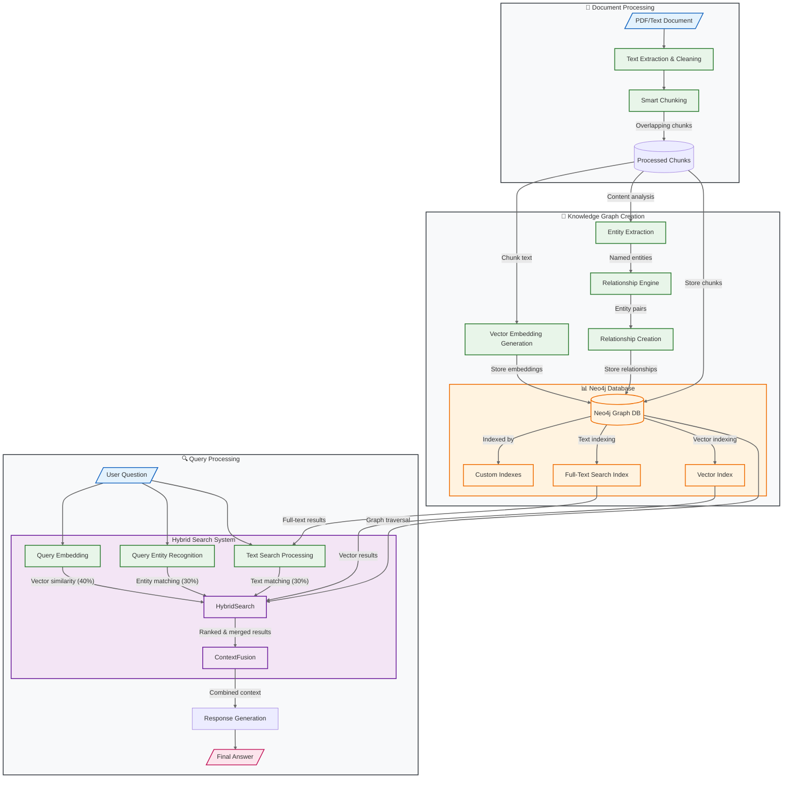

# 🚀 docuGraphRAG.js

A document processing and **RAG (Retrieval-Augmented Generation)** library that transforms unstructured text from documents into rich knowledge graphs and performs entity and relation extraction based on the user's input analysis scope. By using a graph database for enhanced context retrieval, it enables natural conversation with your documents through a chat interface.


## 📖 Project Evolution

docuGraphRAG.js is the successor of [docuRAG.js](https://github.com/msroot/docuRAG.js/), representing a significant architectural shift in how we handle document context and relationships:

- Hybrid search combining vector, text, and graph-based approaches
- Entity extraction and relationship modeling based on the user's scope.
- Efficient storage and retrieval using Neo4j
- Streaming responses for real-time chat interactions
- Configurable search strategies and weights

## Features 🌟

### 1. Document Processing
- Splits documents into manageable chunks
- Generates vector embeddings for each chunk
- Stores content in Neo4j for efficient retrieval

### 2. Hybrid Search System
- Multiple search strategies working together:
  - Vector similarity search (40% weight)
  - Full-text search (30% weight)
  - Graph-based search (30% weight)
- Intelligent result merging and ranking
- Configurable search options
- Efficient storage and retrieval

### 3. Basic Graph Storage
- Stores documents as connected chunks
- Uses Neo4j for efficient storage
- Basic document-chunk relationships
- Entity relationship tracking
- Graph traversal capabilities

### 4. Chat Interface
- Natural language interaction with documents
- Context-aware responses
- Streaming response generation
- Multiple search strategies:
  - Vector similarity search
  - Full-text search
  - Graph-based search
- Configurable search options

## 🛠️ Prerequisites

- Node.js 18+
- Neo4j Database
- OpenAI API Key

## 🚀 Quick Start

1. Clone the repository:
```bash
git clone https://github.com/msroot/docuGraphRAG.js.git
cd docuGraphRAG.js
```

2. Install dependencies:
```bash
npm install
```

3. Create environment file:
```bash
# Create a new .env file
touch .env

# Add the following configuration to your .env file:
NEO4J_URL=bolt://localhost:7687
NEO4J_USER=neo4j
NEO4J_PASSWORD=password
OPENAI_API_KEY=your-openai-key
```

4. Start Neo4j (using Docker):
```bash
docker-compose up -d neo4j
```

Access the Neo4j Browser at [http://localhost:7474/browser/](http://localhost:7474/browser/) to explore your graph database.

5. Run the example app:
```bash
cd app
npm install
npm start
```

The app will be available at http://localhost:3000

## ⚙️ Configuration

| Parameter | Type | Default | Description |
|-----------|------|---------|-------------|
| **Required Settings** |
| `neo4jUrl` | string | - | Neo4j database connection URL |
| `neo4jUser` | string | - | Neo4j database username |
| `neo4jPassword` | string | - | Neo4j database password |
| `openaiApiKey` | string | - | Your OpenAI API key |
| **Optional Settings** |
| `chunkSize` | number | 1000 | Size of document chunks in characters |
| `chunkOverlap` | number | 200 | Overlap between consecutive chunks |
| `similarityThreshold` | number | 0.1 | Minimum similarity score for vector search |
| `vectorSearchWeight` | number | 0.4 | Weight for vector similarity search (0-1) |
| `textSearchWeight` | number | 0.3 | Weight for full-text search (0-1) |
| `graphSearchWeight` | number | 0.3 | Weight for graph-based search (0-1) |

Example `.env` file:
```bash
NEO4J_URL=bolt://localhost:7687
NEO4J_USER=neo4j
NEO4J_PASSWORD=your-password
OPENAI_API_KEY=your-openai-key
VECTOR_SEARCH_WEIGHT=0.4
TEXT_SEARCH_WEIGHT=0.3
GRAPH_SEARCH_WEIGHT=0.3
```

Example configuration in code:
```javascript
import { DocuGraphRAG } from 'docugraphrag';

const config = {
    neo4jUrl: process.env.NEO4J_URL,
    neo4jUser: process.env.NEO4J_USER,
    neo4jPassword: process.env.NEO4J_PASSWORD,
    openaiApiKey: process.env.OPENAI_API_KEY,
    // Optional settings
    chunkSize: 1000,
    chunkOverlap: 200,
    similarityThreshold: 0.1,
    vectorSearchWeight: 0.4,
    textSearchWeight: 0.3,
    graphSearchWeight: 0.3
};

const rag = new DocuGraphRAG(config);
```

## 💻 Usage Example

```javascript
import { DocuGraphRAG } from 'docugraphrag';

// Initialize
const rag = new DocuGraphRAG(config);
await rag.initialize();

// Process a document
const result = await rag.processDocument(text, "Analysis focus description");

// Chat with the document
const answer = await rag.chat("Who is Dr. Sarah Jones?", {
    documentIds: ["doc123"],
    vectorSearch: true,
    textSearch: true,
    graphSearch: true
});
```

## System Architecture 🏗️



## How It Works 🔍

### 1. Document Processing
- Splits documents into manageable chunks
- Generates vector embeddings for each chunk
- Stores content in Neo4j database

### 2. Search Process
When you ask a question:
1. Converts question to vector embedding
2. Finds relevant document chunks using multiple strategies:
   - Vector similarity search
   - Full-text search
   - Graph-based search
3. Merges and ranks results
4. Generates comprehensive answer

### 3. Data Structure
```cypher
(Document)-[:HAS_CHUNK]->(DocumentChunk)
(DocumentChunk)-[:HAS_ENTITY]->(Entity)
(Entity)-[:RELATES_TO]->(Entity)
```

## 📚 Examples


The `examples/` directory contains ready-to-use implementations:

### Express Server Example
```bash
cd examples/express
npm install
npm start
```
The example app provides a complete web interface featuring:
- Document upload and management
- Interactive chat interface with streaming responses
- Real-time Knowledge Graph visualization
  - Visual representation of document relationships
  - Entity connections and relationships
  - Expandable full-screen view
  - Interactive node exploration
- Configurable search strategies:
  - Vector similarity search
  - Full-text search
  - Graph-based search
- Direct access to Neo4j Browser for advanced queries

Visit http://localhost:3000 to explore the interface.

## Contributing 🤝

We welcome contributions! Please check our contributing guidelines for more information.

## Disclaimer ⚠️

**RESEARCH PURPOSES ONLY.** This project, `docuGraphRAG.js`, is strictly intended for research and educational exploration. It has not been designed or tested for production environments and may contain limitations, errors, or security vulnerabilities.

## License 📄

MIT License 

## Support 💬

- Create an issue for bug reports
- Start a discussion for feature requests
- Check our documentation for guides


---

Built with ❤️ by [Yannis Kolovos](https://msroot.me/)