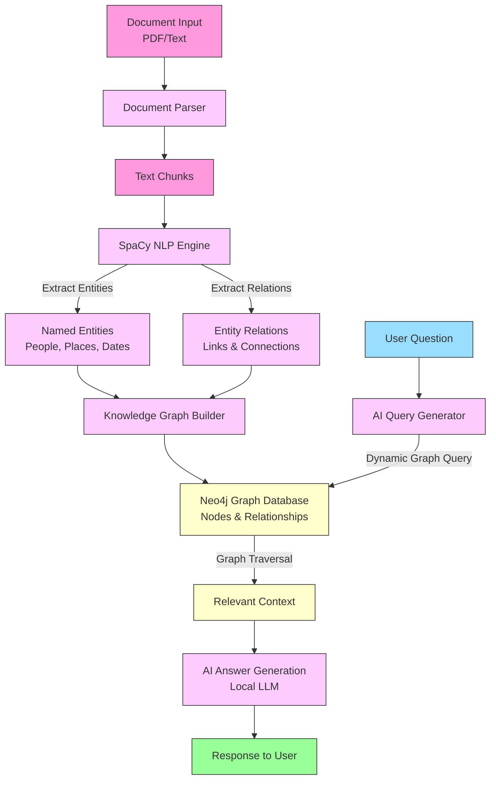

# 🚀 docuGraphRAG.js [WIP]

A document processing and RAG (Retrieval-Augmented Generation) library that converts documents into knowledge graphs. Uses graph databases for context retrieval and enables document interaction through local LLMs.

> ⚠️ **Note**: This project is intended for research and experimental purposes only. It serves as a demonstration of RAG (Retrieval-Augmented Generation) concepts and graph-based document processing techniques.

## 📖 Project Evolution

docuGraphRAG.js builds upon [docuRAG.js](https://github.com/msroot/docuRAG.js/) with a focus on graph-based document representation:

- **docuRAG.js**: Uses Qdrant vector database for similarity search
- **docuGraphRAG.js**: Uses Neo4j graph database for relationship modeling

Key improvements:
- Pattern-based querying
- Explicit relationship modeling
- Multi-hop reasoning
- Relationship metadata preservation

## ✨ Features

- 📄 Document chunking and processing
- 🔍 SpaCy-based entity extraction
- 📊 Neo4j graph representation
- 🤖 Ollama LLM integration
- 🎯 Semantic search
- 📡 Response streaming
- 🔄 Relationship inference
- 🎨 Neo4j Browser visualization

## 🛠️ Prerequisites

- Docker & Docker Compose
- Node.js 18+
- 8GB free disk space (Mistral model: 4GB)
- Minimum 10GB RAM available for Ollama service (using Mistral model)

## 🚀 Quick Start

1. Clone and enter directory:
```bash
git clone https://github.com/msroot/docuGraphRAG.js.git
cd docuGraphRAG.js
```

2. Start services:
```bash
docker-compose up -d
```
> ⚠️ First run downloads Mistral model (~4GB)

3. Install dependencies:
```bash
npm install
```

## 🌐 Services

- Neo4j: http://localhost:7474 (neo4j/password)
- SpaCy: http://localhost:8080
- Ollama: http://localhost:11434

## 💻 Usage

```javascript
import { DocuGraphRAG } from 'docugraphrag';

// Initialize
const rag = new DocuGraphRAG({
  neo4jUrl: 'bolt://localhost:7687',
  neo4jUser: 'neo4j',
  neo4jPassword: 'password',
  debug: true
});

await rag.initialize();

// Process document
const buffer = fs.readFileSync('document.pdf');
const result = await rag.processDocument(buffer, 'document.pdf');

// Query document
const response = await rag.chat('What is the main topic?');
console.log(response.answer);
```

## 🏗️ Architecture

The system processes documents through five main stages:

1. Document Processing: Text extraction and semantic chunking
2. Entity Analysis: NLP-based entity and relationship extraction via SpaCy
3. Graph Construction: Building Neo4j graph from entities and relationships
4. Context Retrieval: Query-based graph traversal for relevant segments
5. Response Generation: LLM-powered answer synthesis from retrieved context



## ⚙️ Configuration

| Option | Description | Default |
|--------|-------------|---------|
| neo4jUrl | Neo4j URL | bolt://localhost:7687 |
| neo4jUser | Neo4j username | neo4j |
| neo4jPassword | Neo4j password | password |
| spacyApiUrl | SpaCy endpoint | http://localhost:8080 |
| ollamaApiUrl | Ollama endpoint | http://localhost:11434/api/generate |
| chunkSize | Document chunk size | 1000 |
| chunkOverlap | Chunk overlap | 200 |
| searchLimit | Max results | 3 |
| debug | Debug mode | false |

## 🔧 Troubleshooting

1. **Neo4j**
   - Check container: `docker ps`
   - View logs: `docker logs neo4j`
   - Verify config

2. **SpaCy**
   - Check container: `docker ps`
   - View logs: `docker logs spacyapi`

3. **Ollama**
   - Check model: `docker logs ollama`
   - Test API: `curl http://localhost:11434/api/generate`
   - Memory Issues:
     - Error "model requires more system memory than is available": The Mistral model requires 10.8GB of system memory
     - Common symptoms:
       - Available memory: System shows only ~1.1GB available when 4.8GB is needed
       - Logs show: "model request too large for system"
       - No GPU detected: "no compatible GPUs were discovered"
     - Solutions:
       1. Increase system resources:
          - Ensure your system has at least 6GB total RAM (4.8GB for model + overhead)
          - In Docker Desktop: Increase memory allocation to at least 5GB
          - Check swap space availability (recommended: at least 1GB)
     - Best Practices:
       - Monitor system resources: `docker stats`
       - Check logs for memory warnings: `docker logs ollama`
       - Consider GPU support for better performance

## 📚 Examples

See `examples/` for:
- Express integration
- Document processing
- Query patterns
- Entity extraction

## 🤝 Contributing

Submit Pull Requests for:
- Bug fixes
- New features
- Documentation
- Tests

## 📝 License

MIT License - See [LICENSE](LICENSE)

## 🙏 Acknowledgments

Built with:
- [Neo4j](https://neo4j.com/) - Graph Database
- [SpaCy](https://spacy.io/) - NLP
- [Ollama](https://ollama.ai/) - LLM
- [Node.js](https://nodejs.org/) - Runtime

---
👨‍💻 🚀 ❤️ By [Yannis Kolovos](http://msroot.me)