# 🚀 docuGraphRAG.js 


📝 A powerful document processing and RAG (Retrieval-Augmented Generation) library that transforms unstructured text from documents into rich knowledge graphs. By leveraging graph databases for enhanced context retrieval, it enables natural conversation with your documents through an intelligent chat interface.

> **⚠️ RESEARCH PURPOSES ONLY**: This project is intended for research and educational purposes. It is not recommended for production use without proper evaluation and modifications.

## 📖 Project Evolution

docuGraphRAG.js is the successor of [docuRAG.js](https://github.com/msroot/docuRAG.js/), representing a significant architectural shift in how we handle document context and relationships:

- Complex relationship patterns can be discovered and queried
- Entity relationships are explicitly modeled and traversable
- Multi-hop reasoning becomes possible through graph traversal
- Better context preservation through relationship metadata

## Features 🌟

### 1. Document Processing
- Splits documents into manageable chunks
- Generates vector embeddings for each chunk
- Stores content in Neo4j for efficient retrieval

### 2. Vector Search
- Semantic understanding using embeddings
- Find conceptually related content
- Efficient embedding storage and retrieval

### 3. Basic Graph Storage
- Stores documents as connected chunks
- Uses Neo4j for efficient storage
- Basic document-chunk relationships

### 4. Chat Interface
- Natural language interaction with documents
- Context-aware responses
- Streaming response generation

## 🛠️ Prerequisites

- Node.js 18+
- Neo4j Database
- OpenAI API Key
- At least 8GB of free disk space

## 🚀 Quick Start

1. Clone the repository:
```bash
git clone https://github.com/msroot/docuGraphRAG.js.git
cd docuGraphRAG.js
```

2. Install dependencies:
```bash
npm install
```

3. Create environment file:
```bash
# Create a new .env file
touch .env

# Add the following configuration to your .env file:
NEO4J_URL=bolt://localhost:7687
NEO4J_USER=neo4j
NEO4J_PASSWORD=your-password
OPENAI_API_KEY=your-openai-key
```

4. Using Docker (Optional):
```bash
# Start Neo4j
docker-compose up -d neo4j

# Start the application
docker-compose up app
```

## ⚙️ Configuration

| Parameter | Type | Default | Description |
|-----------|------|---------|-------------|
| **Required Settings** |
| `neo4jUrl` | string | - | Neo4j database connection URL |
| `neo4jUser` | string | - | Neo4j database username |
| `neo4jPassword` | string | - | Neo4j database password |
| `openaiApiKey` | string | - | Your OpenAI API key |
| **Optional Settings** |
| `chunkSize` | number | 1000 | Size of document chunks in characters |
| `chunkOverlap` | number | 200 | Overlap between consecutive chunks |
| `debug` | boolean | true | Enable debug logging |

Example `.env` file:
```bash
NEO4J_URL=bolt://localhost:7687
NEO4J_USER=neo4j
NEO4J_PASSWORD=your-password
OPENAI_API_KEY=your-openai-key
```

Example configuration in code:
```javascript
import { DocuGraphRAG } from 'docugraphrag';

const config = {
    neo4jUrl: process.env.NEO4J_URL,
    neo4jUser: process.env.NEO4J_USER,
    neo4jPassword: process.env.NEO4J_PASSWORD,
    openaiApiKey: process.env.OPENAI_API_KEY,
    // Optional settings
    chunkSize: 1000,
    chunkOverlap: 200,
    debug: true
};

const rag = new DocuGraphRAG(config);
```

## 💻 Usage Example

```javascript
import { DocuGraphRAG } from 'docugraphrag';

// Initialize
const rag = new DocuGraphRAG(config);
await rag.initialize();

// Process a document
const result = await rag.processDocument(text, "Analysis focus description");

// Chat with the document
const answer = await rag.chat("Who is Dr. Sarah Jones?", { documentId: "doc123" });
```

## System Architecture 🏗️

```mermaid
graph TD
    subgraph Document_Processing ["📄 Document Processing"]
        DocInput[/"PDF/Text Document"/] --> TextProc["Text Extraction & Cleaning"]
        TextProc --> Chunking["Smart Chunking"]
        Chunking -->|"Overlapping chunks"| Chunks[(Processed Chunks)]
    end

    subgraph Knowledge_Graph_Creation ["🧠 Knowledge Graph Creation"]
        Chunks --> |"Chunk text"| VectorGen["Vector Embedding Generation"]
        Chunks --> |"Content analysis"| EntityExt["Entity Extraction"]
        
        EntityExt --> |"Named entities"| RelEngine["Relationship Engine"]
        RelEngine --> |"Entity pairs"| RelCreation["Relationship Creation"]
        
        subgraph Neo4j_Storage ["📊 Neo4j Database"]
            GraphDB[("Neo4j Graph DB")]
            Indexes["Custom Indexes"]
            TextIndex["Full-Text Search Index"]
            GraphDB --> |"Indexed by"| Indexes
            GraphDB --> |"Text indexing"| TextIndex
        end
        
        VectorGen --> |"Store embeddings"| GraphDB
        RelCreation --> |"Store relationships"| GraphDB
        Chunks --> |"Store chunks"| GraphDB
    end

    subgraph Query_Processing ["🔍 Query Processing"]
        UserQuery[/"User Question"/] --> QueryEmbed["Query Embedding"]
        UserQuery --> QueryEntity["Query Entity Recognition"]
        UserQuery --> TextSearch["Text Search Processing"]
        
        subgraph Search_System ["Hybrid Search System"]
            QueryEmbed --> |"Vector similarity (40%)"| HybridSearch
            QueryEntity --> |"Entity matching (30%)"| HybridSearch
            TextSearch --> |"Text matching (30%)"| HybridSearch
            
            TextIndex --> |"Full-text results"| TextSearch
            GraphDB --> |"Graph traversal"| HybridSearch
            
            HybridSearch --> |"Ranked & merged results"| ContextFusion
        end
        
        ContextFusion --> |"Combined context"| RespGen["Response Generation"]
        RespGen --> Answer[/"Final Answer"/]
    end

    %% Styling
    classDef input fill:#e3f2fd,stroke:#1565c0,stroke-width:2px;
    classDef process fill:#e8f5e9,stroke:#2e7d32,stroke-width:2px;
    classDef database fill:#fff3e0,stroke:#ef6c00,stroke-width:2px;
    classDef search fill:#f3e5f5,stroke:#6a1b9a,stroke-width:2px;
    classDef output fill:#fce4ec,stroke:#c2185b,stroke-width:2px;
    
    class DocInput,UserQuery input;
    class TextProc,Chunking,VectorGen,EntityExt,RelEngine,RelCreation,QueryEmbed,QueryEntity,TextSearch process;
    class GraphDB,Indexes,TextIndex database;
    class HybridSearch,ContextFusion search;
    class Answer output;

    %% Subgraph styling
    style Document_Processing fill:#f8f9fa,stroke:#343a40,stroke-width:2px;
    style Knowledge_Graph_Creation fill:#f8f9fa,stroke:#343a40,stroke-width:2px;
    style Query_Processing fill:#f8f9fa,stroke:#343a40,stroke-width:2px;
    style Neo4j_Storage fill:#fff3e0,stroke:#ef6c00,stroke-width:2px;
    style Search_System fill:#f3e5f5,stroke:#6a1b9a,stroke-width:2px;

    %% Relationships
    linkStyle default stroke:#666,stroke-width:2px;
```



## How It Works 🔍

### 1. Document Processing
- Splits documents into manageable chunks
- Generates vector embeddings for each chunk
- Stores content in Neo4j database

### 2. Search Process
When you ask a question:
1. Converts question to vector embedding
2. Finds relevant document chunks
3. Generates comprehensive answer

### 3. Data Structure
```cypher
(Document)-[:HAS_CHUNK]->(DocumentChunk)
```

## API Reference 📚

### Core Methods
- `processDocument(text, analysisDescription)`: Process and index a document
- `chat(question, options)`: Ask questions about your documents

## 🔧 Troubleshooting

1. **Neo4j Connection Issues**
   - Ensure Neo4j is running and accessible
   - Check connection credentials
   - Verify network connectivity

2. **Search Issues**
   - Verify indexes are created properly
   - Check document processing completed successfully
   - Ensure sufficient data is loaded

3. **Performance Issues**
   - Monitor memory usage
   - Check query execution plans
   - Optimize index usage

## 📚 Examples

The `examples/` directory contains ready-to-use implementations:

### Express Server Example
```bash
cd examples/express
npm install
npm start
```
Demonstrates a web interface for document chat and visualization.

### Basic Processing Example
```bash
cd examples/basic
npm install
npm start
```

## 🗺️ Roadmap

### Implemented ✓
- Hybrid Search System
  - Vector similarity (OpenAI embeddings)
  - Full-text search (Neo4j indexes)
  - Graph-based retrieval
  - Weighted scoring (40/30/30)

### Coming Soon 🚀
- Extended Data Ingestion
  - PDF (pdf.js + OCR)
  - Web pages (Puppeteer)
  - GitHub repos
  - Markdown/MDX

- Advanced Graph Algorithms
  - Path-finding traversal
  - Temporal relationship analysis
  - Semantic subgraph extraction
  - Weighted relationship scoring

- Search Enhancements
  - Multi-hop reasoning
  - Bi-directional relevance
  - Dynamic context windows

## Contributing 🤝

We welcome contributions! Please check our contributing guidelines for more information.

## License 📄

MIT License 

## Support 💬

- Create an issue for bug reports
- Start a discussion for feature requests
- Check our documentation for guides

---

Built with ❤️ by [Yannis Kolovos](http://msroot.me/)